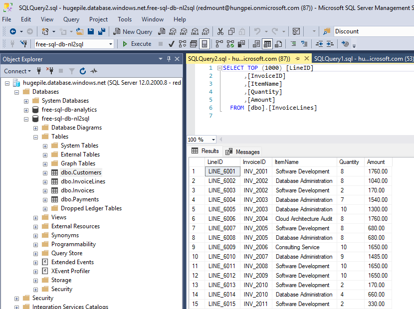
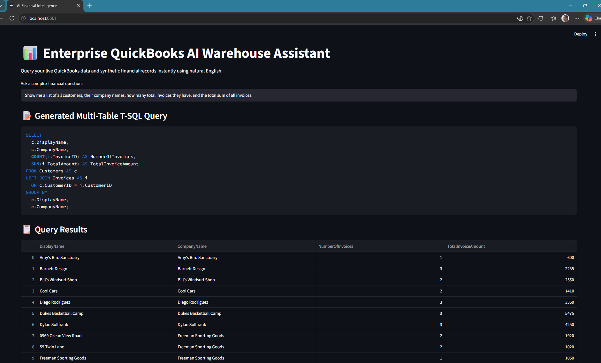
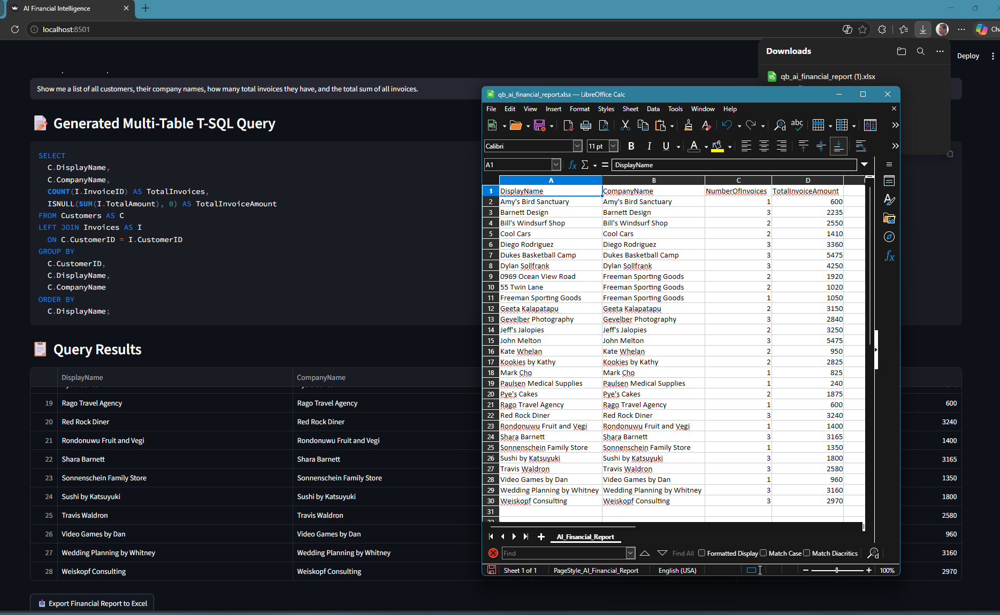

# 📊 Enterprise QuickBooks NL2SQL AI Warehouse Engine

> **A Dual-Engine (Local & Cloud) Financial Natural Language Query System**  
> Translates conversational natural language into production-grade T-SQL queries executed directly against a structured 4-table financial data warehouse. Built for multi-tenant scalability, strict privacy guardrails, and enterprise accounting compliance.

---

## 🏗️ Application Architecture

The system operates across two selectable deployment topologies, designed to handle both strictly confidential on-premises workloads and high-throughput cloud environments:

```
                  ┌─────────────────────────────────────────┐
                  │        Intuit QuickBooks Cloud          │
                  │             (Sandbox API)               │
                  └────────────────────┬────────────────────┘
                                       │ (OAuth 2.0 ETL Pipeline)
                                       ▼
                  ┌─────────────────────────────────────────┐
                  │    Local Computer / Bridge Instance     │
                  │   (Data Extraction & Transformation)    │
                  └──────────┬────────────────────┬─────────┘
                             │                    │
          Option A (Local)   │                    │   Option B (Cloud)
                             ▼                    ▼
           ┌───────────────────┐        ┌───────────────────┐
           │ MS SQL Server     │        │ Azure SQL Cloud   │
           │ (.\SQLEXPRESS)    │        │ Warehouse         │
           └─────────┬─────────┘        └─────────┬─────────┘
                     │                            │
                     │  ┌──────────────────────┐  │
                     └─►│  Streamlit UI Engine ├──┘
                        │  (Natural Language) │
                        └──────────┬──────────┘
                                   │
                    ┌──────────────┴──────────────┐
                    │                             │
                    ▼                             ▼
         ┌─────────────────────┐       ┌─────────────────────┐
         │ Ollama (Llama 3 /   │       │ Google Gemini AI    │
         │ DeepSeek-R1)        │       │ (gemini-2.5-flash)  │
         │ [100% Private]      │       │ [Enterprise Cloud]  │
         └─────────────────────┘       └─────────────────────┘
```

---

## 📋 Table of Contents
1. [Step-by-Step Implementation Strategy](#-step-by-step-implementation-strategy)
2. [Essential Accounting Guardrails](#-essential-accounting-guardrails)
3. [Required SDKs & Python Packages](#-required-sdks--python-packages)
4. [QuickBooks Warehouse Schema Definition](#-quickbooks-warehouse-schema-definition)
5. [Project Directory Structure](#-project-directory-structure)
6. [ETL Pipeline Layer (Extract, Transform, Load)](#-etl-pipeline-layer-extract-transform-load)
7. [Option A: 100% Private Local Stack (Zero Data Leaks)](#-option-a-100-private-local-stack-zero-data-leaks)
8. [Option B: Enterprise Cloud Stack (Scalable & Light)](#-option-b-enterprise-cloud-stack-scalable--light)
9. [Streamlit UI & Multi-Stack Architecture](#-streamlit-ui--multi-stack-architecture)
10. [Troubleshooting & API Handling (Gemini 503 Errors)](#-troubleshooting--api-handling)
11. [GitHub Repository Checklist & Security Guide](#-github-repository-checklist--security-guide)

---

## 🚀 Step-by-Step Implementation Strategy

1. **OAuth 2.0 Authentication Handshake:** Establish a secure authorization bridge between Intuit QuickBooks Cloud and the local extraction pipeline using automated token refresh management (`connect.py` -> `tokens.env`).
2. **Schema Modeling:** Establish a relational star-schema warehouse layout optimized for double-entry financial reporting (Customers, Invoices, InvoiceLines, Payments).
3. **ETL Pipeline Execution:** Pull unstructured API payloads, parse transaction relations, compute net balance distributions, and load normalized tables into Microsoft SQL Server.
4. **Local Stack Deployment (Option A):** Pair local SQL Express instance with Ollama (Llama 3 / DeepSeek-R1) for 100% offline, privacy-compliant query translation.
5. **Cloud Stack Deployment (Option B):** Provision Azure SQL Server with Entra ID MFA authentication and connect Google Gemini AI (`google-genai` SDK) for sub-second, multi-tenant enterprise intelligence.
6. **Unified Analytics Interface:** Deliver interactive SQL visualization, schema enforcement, execution verification, and Excel extraction capabilities inside Streamlit.

---

## 🛡️ Essential Accounting Guardrails

Financial data modeling demands strict domain rules to prevent data corruption and ensure compliance:

* **Double-Entry Balance Validation:** Payments are strictly constrained to valid `InvoiceID` foreign keys to ensure ledger reconciliation.
* **Deterministic SQL Generation:** AI prompt system instructions enforce `temperature=0.0` to eliminate hallucinations and non-deterministic query variations.
* **Raw T-SQL Code Enforcement:** Prompts require raw executable T-SQL code without markdown block wraps (` ```sql `) or narrative prose that could break automated execution drivers.
* **Safe Search Constraints:** String queries automatically use wildcard pattern matching (`LIKE '%...%'`) to accommodate varying customer and item naming formats.
* **Credential Isolation:** OAuth secrets, API keys, database connection strings, and tokens are compartmentalized into git-ignored `.env` files.

---

## 📦 Required SDKs & Python Packages

Create a virtual environment and install dependencies via `pip`:

```bash
python -m venv venv
venv\Scripts\activate  # On Windows
pip install -r requirements.txt
```

### `requirements.txt`
```text
pyodbc>=4.0.39
pandas>=2.0.0
openpyxl>=3.1.2
streamlit>=1.30.0
python-dotenv>=1.0.0
requests>=2.31.0
google-genai>=0.1.0
```

---

## 🗄️ QuickBooks Warehouse Schema Definition

The warehouse normalizes QuickBooks JSON objects into a clean 4-table relational database model:

```sql
-- 1. Customers Master Table
CREATE TABLE Customers (
    CustomerID VARCHAR(50) PRIMARY KEY,
    DisplayName NVARCHAR(255),
    CompanyName NVARCHAR(255),
    Balance DECIMAL(18, 2),
    Active BIT
);

-- 2. Invoices Table
CREATE TABLE Invoices (
    InvoiceID VARCHAR(50) PRIMARY KEY,
    CustomerID VARCHAR(50) FOREIGN KEY REFERENCES Customers(CustomerID),
    DocNumber NVARCHAR(50),
    TxnDate DATE,
    TotalAmount DECIMAL(18, 2)
);

-- 3. Invoice Line Items Table
CREATE TABLE InvoiceLines (
    LineID VARCHAR(50) PRIMARY KEY,
    InvoiceID VARCHAR(50) FOREIGN KEY REFERENCES Invoices(InvoiceID),
    ItemName NVARCHAR(255),
    Quantity INT,
    Amount DECIMAL(18, 2)
);

-- 4. Payments Table
CREATE TABLE Payments (
    PaymentID VARCHAR(50) PRIMARY KEY,
    CustomerID VARCHAR(50) FOREIGN KEY REFERENCES Customers(CustomerID),
    InvoiceID VARCHAR(50) FOREIGN KEY REFERENCES Invoices(InvoiceID),
    PaymentDate DATE,
    AmountPaid DECIMAL(18, 2)
);
```

---

## 📂 Project Directory Structure

```text
├── config/
│   ├── engine_local.py      # MS SQL Server local connection manager (pyodbc)
│   └── engine_cloud.py      # Azure SQL Server connection manager with MFA/Entra ID
├── .env                     # App secrets (Azure credentials, Gemini API key, DB settings)
├── .env.example             # Template for public repo configuration
├── tokens.env               # Auto-managed QuickBooks OAuth access & refresh tokens
├── connect.py               # OAuth 2.0 handshake script (auto-saves to tokens.env)
├── sync_to_mssql.py       # ETL script: Intuit Cloud -> MS SQL Server (Local)
├── deploy_to_cloud.py       # ETL script: Intuit Cloud -> Azure SQL Database (Cloud)
├── app_local.py             # Local UI: Streamlit + Ollama (100% Offline)
├── app_cloud.py             # Cloud UI: Streamlit + Google Gemini + Multi-Stack Toggle
├── requirements.txt         # Dependency declarations
├── .gitignore               # Excludes secrets, tokens, and database caches
└── README.md                # System documentation
```

---

## 🔄 ETL Pipeline Layer (Extract, Transform, Load)

The ETL engine handles data conversion across three distinct stages:

```
  [Intuit QuickBooks Cloud] ──► [Python Transformation Engine] ──► [MS SQL Server / Azure SQL]
        (Extract)                       (Transform)                        (Load)
```

1. **The Source: Intuit QuickBooks Cloud (Extract)**
   * Connects via OAuth 2.0 to Intuit Developer REST API endpoints.
   * Pulls raw JSON responses for `Customer`, `Invoice`, and `Payment` entities.
2. **The Engine: Python Pipeline (Transform)**
   * Cleans nested structures, extracts line item details, maps entity IDs, formats decimal values, and converts dates to SQL-compatible standard types.
3. **The Destination: `.\SQLEXPRESS` or Azure SQL (Load)**
   * Drops stale staging tables (if re-indexing), recreates relational constraints, and batches inserts into target SQL instances using `pyodbc`.

---

## 🏠 Option A: 100% Private Local Stack (Zero Data Leaks)

Designed for strict data sovereignty requirements where financial records must never leave the local network.

### 1. OAuth Handshake
Run the authentication script to spawn a local web listener and complete Intuit login:
```powershell
python connect.py
```
*Token auto-saves to `tokens.env`.*

### 2. Local Database Hydration
Execute the local ETL script to construct schema and insert records into local SQL Express:
```powershell
python sync_to_mssql.py
```



### 3. Launch Offline Natural Language Interface
Launch the Streamlit interface connected to local Ollama (Llama 3 / DeepSeek-R1):
```powershell
streamlit run app_local.py
```



---

## ☁️ Option B: Enterprise Cloud Stack (Scalable & Light)

Designed for cloud analytics environments requiring global multi-tenant access and sub-second natural language inference.

### 1. Azure SQL Database Provisioning
1. Create an Azure SQL Server instance (e.g., `hugepile.database.windows.net`).
2. Create a dedicated database with **Basic Tier** pricing (e.g., `quickbookwarehousecloud`).
3. Add your client IP address under **SQL Server > Networking > Firewall Rules**.

### 2. Configure Database Entra ID Permissions
In SQL Server Management Studio (SSMS), target `quickbookwarehousecloud` and run:
```sql
CREATE USER [your.email@domain.com] FROM EXTERNAL PROVIDER;
ALTER ROLE db_owner ADD MEMBER [your.email@domain.com];
```

### 3. Execute Cloud Migration Pipeline
Run the cloud deployment script to move QuickBooks records straight to Azure:
```powershell
python deploy_to_cloud.py
```

### 4. Launch Cloud Dashboard
Fire up the multi-stack cloud dashboard powered by Google Gemini AI:
```powershell
streamlit run app_cloud.py
```



---

## 🖥️ Streamlit UI & Multi-Stack Architecture

`app_cloud.py` includes a sidebar **Environment Selector** allowing real-time switching between local and cloud databases without restarting the application:

* **Natural Language Input:** Converts user prompt into structured SQL using `gemini-2.5-flash` with zero-temperature determinism.
* **Live Query Preview:** Displays generated T-SQL before execution for transparency and auditing.
* **Interactive Data Table:** Renders execution results in high-performance Pandas dataframes.
* **One-Click Excel Exporter:** Built-in download handler exports formatted query extractions to `.xlsx`.

---

## ⚡ Troubleshooting & API Handling

### Handling Gemini `503 UNAVAILABLE` Errors
When using cloud models during peak global demand, Google's API may return:
`503 UNAVAILABLE: This model is currently experiencing high demand.`

**Mitigation Strategies:**
1. **Retry Logic (Built-in):** Wait 30 seconds and resubmit the prompt; demand spikes resolve rapidly.
2. **Model Fallback:** Swap `gemini-2.5-flash` to `gemini-1.5-flash` or `gemini-2.5-pro` in `app_cloud.py`:
   ```python
   response = ai_client.models.generate_content(
       model='gemini-1.5-flash',
       contents=user_query,
       config=types.GenerateContentConfig(system_instruction=SCHEMA_PROMPT, temperature=0.0)
   )
   ```
3. **Database Timeout Guard:** `engine_cloud.py` includes `Connection Timeout=15;` to prevent UI thread locking during network handshakes.

---
